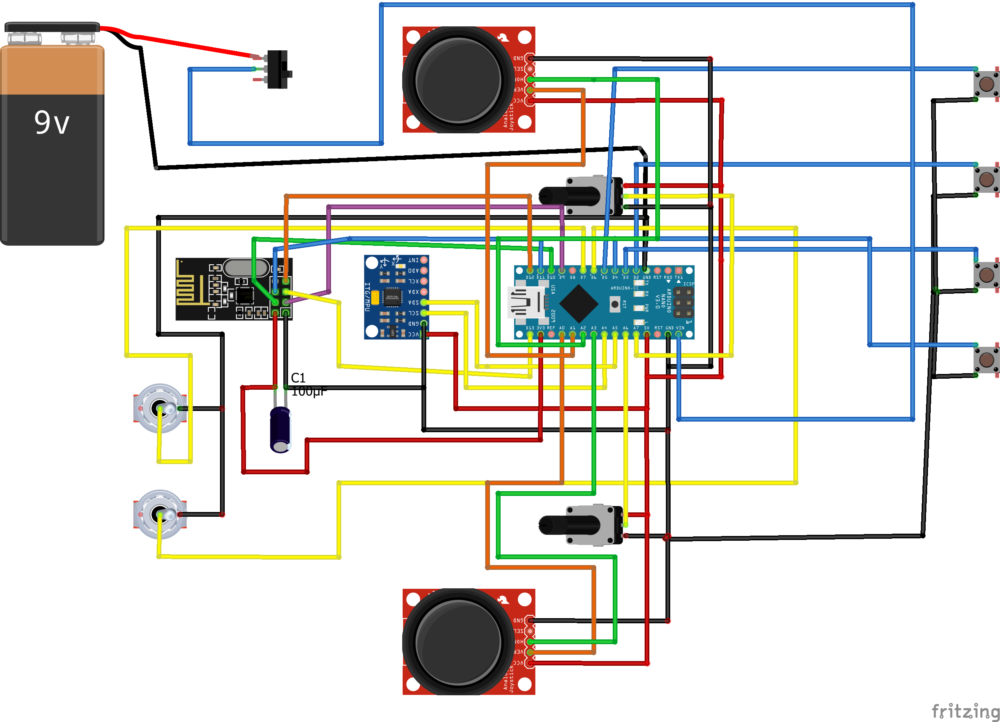
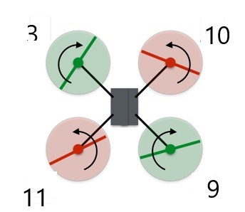
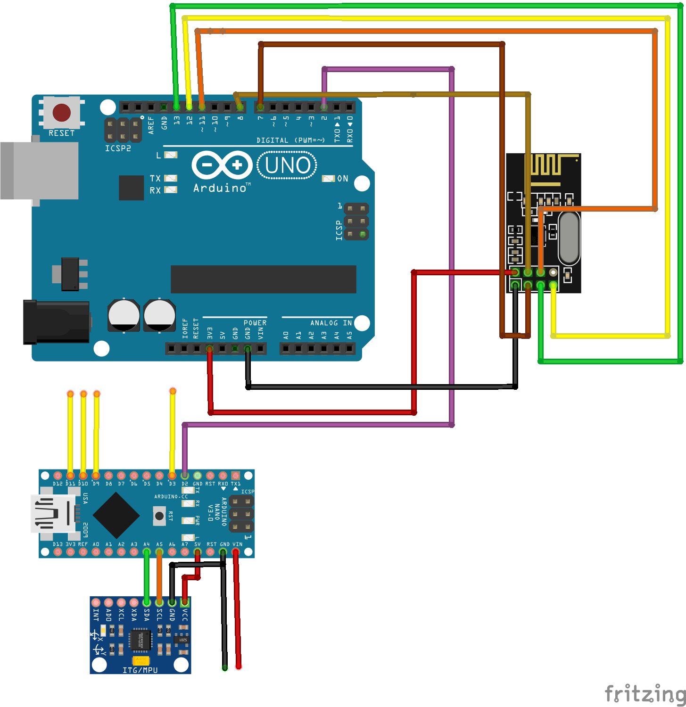

# Flight Controller #

You can see few flight attempt and controller videos [here](https://drive.google.com/drive/folders/1n47UaSTP3HyPnfKxreSLd4t1mSBWviDk?usp=sharing)

A simple arduino based flight controller that uses MPU6050 Gyro-Accelerometer and NRF24L01 transmission-Reciever module.

## Use Case ##

Normal flight controller usually available in the market are costly and are preprogrammed modules.Instead if we can use it arduino based then we can replicate similar functionalities by integration with various sensor for better caliberation and handling of the module.More over these drones can be highly used for agricultural,safety,surveillance,traffic control,forest fire,delivering and many more.

## This tutorial explain how to create a drone and RC transmitter ##

### Transmitter ###

For this tutorial we don't need very components in the figure but this remote can adopt to changes in number of sensor (eg:if we want to add more sensors to the drone the remote can be programmed based on that).

note:It's important to add capacitors across the teminal VCC and GND of the NRF24L01.

After creating circuit Upload the code:Transmitter_JoyStick.ino

## Before all the codes in reciever few things are to be done ## 
### 1.Caliberation of the ESC ###
For this section make the connection as shown below in and upload the code.
CAUTION:Don't keep the propeller attached to the motor and turn on the battery.
1.Upload code Caliberation_ESC.ino 
2.Open Serial Monitor
3.Turn on the batter
4.Give input 1000 and 2000 (may vary depending on ESC and motor but 30A ESC recommended)
5.Do it for all four.Make sure the orientation are proper for motor when they are going to attached to the drone

### 2.Caliberation of Accelerometer ###

Caliberation of the Accelerometer is done using Mulitiwii platform

1.open config.h in Multiwii.ino file
2.Make changes in config.h of as same as config.h in this repository
3.upload the code to arduino nano( MPU6050 is attached to it)
4.Open Java Processing file of the same
5.Select the COM and click on read
6.Orient Your MPU6050 in all direction and "Caliberate Accelerometer" and "Write"
7.Close the processing and reopen it select "Angle" and "Horizon" as high click "Write"

### Reciever ###

The design of the reciever unit is as shown below

The pin D3,D9,D10,D11 are connected to the digital pins of the esc
and all the GND of ESC should be connected to GND of Arduino Nano.And VCC of any ESC can be connected to Nano innorder to power the nano.

The pin D2 Nano --> D2 of UNO is used for PPM communication

Now you can upload the Reciever_UNO.ino to arduino UNO and FightController_NANO.ino to the UNO and NANO rescpectively.

Power on the drone and joystick.
Make the throttle value minimum and roll to maximum.Your drone will power on.

This article will keep on editting.
Thank You
